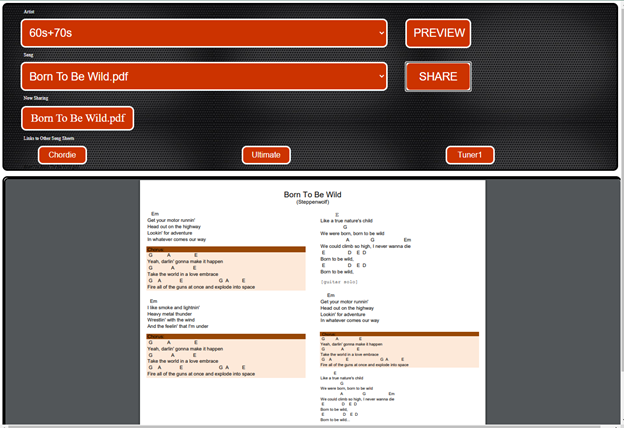
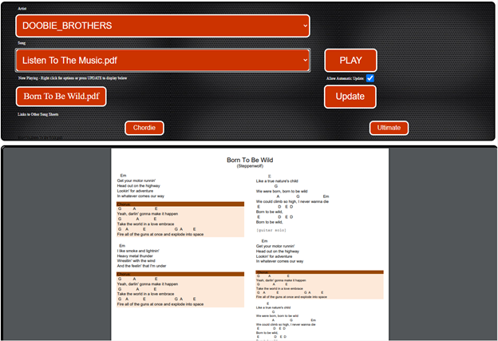

# Song-Sheet-Sharing-Web-Pages

The successful introduction of realtime online music collaboration software has created a community of musicans that join ad-hoc online jam sessions. For most players, these sessions work best when song sheets can be shared in real-time. Existing applications require all the players to install an application on their PC or tablets. 305keepers is a Web application that allows a band leader to push song sheets to online musicians in real time.

Songsheets are stored as single page pdfs in a filesystem arranged by artist and/or genre. The Jam Leader points their browser to a password protected push.php and can browse and select the next song to be played.

Players point their browser to "pull.php" where they can browse the songlist and songsheets. In addition, the song selected by the Jam Leader is also displayed as a link which can be manually selected to appear on the current page, on a new page or on a new tab. The Jam Member can also choose to allow the current song to automatically display on the current page.

The first implementation was implemented on an AWS Lighthouse/Lamp server. Besides the song sheet library and the push/pull.php pages, there are a few php files that respond to javascript/ajax requests to update the "Now Playing" song choice and to form the urls to display the pdfs.

## Screenshots

### Jam Leader Page

### Jammer's Page

